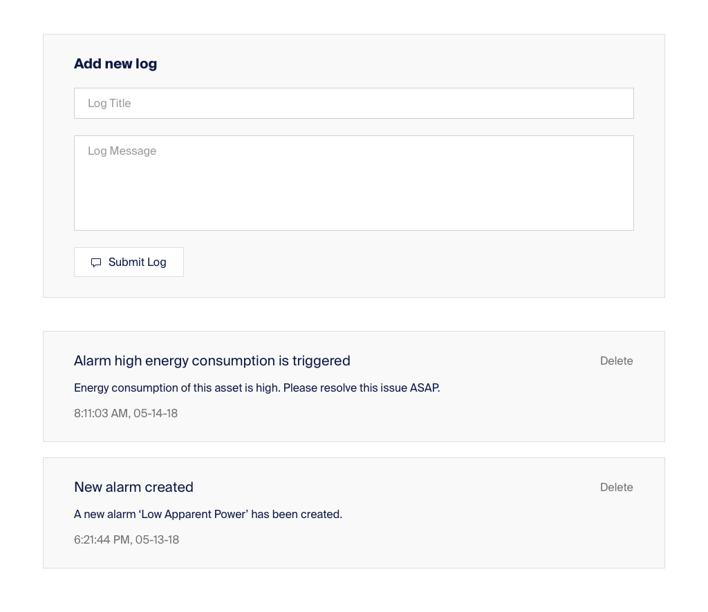

# Tagup front-end challenge

Thanks for your interest in joining our team! This challenge is a simple test for us to evaluate your technical abilities in advance of meeting in person.

Your objective is to create a mini timeline app. Detailed requirements are below. You may use the picture below as a design reference (though are in no way bound by its design):

## Key requirements
- Build reusable components for cards and buttons;
- When clicking `Submit Log` button in the form, a new log will be added to the list of cards below;
- Each timeline item contains a title, a message and a formatted date like in the picture;
- You should fork this repository and implement you solution inside the repo. Please provide a README file with instructions on how to run your app locally.

## Hints
- You can use any of these three frameworks to build your app: Vue, React or Angular;
- You can use static data or generate it yourself. No need to request it from an API;
- You may use a 3rd party library (for example, moment.js).
- Please treat the design reference as a wireframe. Feel free to use you own design sense to improve the style.

## Bonus Points
- Show a confirmation modal when pressing delete button with "Yes/Cancel" buttons, and delete the selected log when pressing "Yes".
- Write test cases for your app. These can be unit test or E2E with Jest, Karma, Nightwatch etc.
- Feel free to add more features: we're curious about what you can think of. We'd expect the same if you worked with us!

## What we will take into consideration
- The code contains the mentioned components: Cards, Button, and optionally a modal
- Reusability of the components
- Code cleanliness and readability
- Overall functionality

## What we will NOT take into consideration
- The framework you choose to build this app. You can even use vanilla web components if you'd like, so long as your code is clean and easy to understand.

If you have any questions at all, please don't hesitate to email [jobs@tagup.io](mailto:jobs@tagup.io) and we'll get back to you ASAP.

