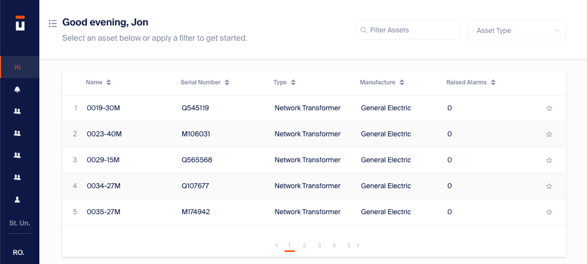

# UI/UX Designer Challenge

## Overview

Thank you for participating in our UI/UX designer challenge. This challenge is an example of the work we do every day. The objective is to get a sense for how you think about product design, user experience, and application interface.

## Project Description

Our web application is used by our customers to view summary statistics for their equipment fleets and to understand the time until equipment failure. The dashboard is the first view users have while logging into the application. A partial screenshot showing this list is included here:

 

The current implementation is limited: there are many other data types, measurements, and information that users are asking for. Data that might be rendered in this view include:
- Equipment Name
-	Manufacturer
-	Asset Type (for example, Network Transformer, GSU Transformer, Reverse Osmosis)
-	Asset status (one of In Use, Available, In Repair, Decommissioned, or Down.
-	Remaining Useful Life (the output of our analytics, abbreviated “RUL”)
-	Hazard (the probability of failure in the next twelve hours)
-	Failure Date (predicted failure date)
-	Equipment Photo (or a default icon for the asset type if no photo is available)
-	Location
-	Star/Unstar (similar to GitHub or Heroku designs)
-	Add log entry/Add User (additional actions tied to the equipment)
-	In alarm (binary: yes/no)
-	Serial Number
-	Last updated timestamp

Your objective is to come up with a low fidelity mock up making any subset of this data available to users, replacing the existing table design we have. Please do not feel constrained by a table. Any list, card, table, or other design method is a possibility!

## Deliverable

Solutions should be submitted preferably as a Sketch or Illustrator file. Bonus points are provided for design variations and interaction design.

